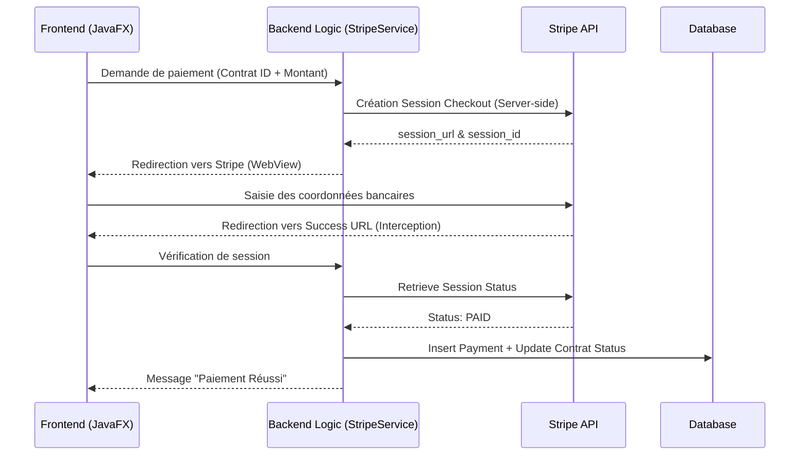

# Stripe Payment Architecture - Khademni Platform

Cette documentation détaille l'intégration propre de Stripe dans le projet Khademni, en suivant une architecture sécurisée et scalable.

## 🏗️ Architecture Globale

L'architecture suit le flux recommandé par Stripe :



## 1. 📂 Structure du Projet (Maven)

Voici l'organisation recommandée pour une intégration propre :

```text
src/main/java/com/khademni/
├── App.java (Main)
├── controller/
│   ├── PaiementController.java   (Gestion UI & Redirection)
│   └── PaiementFormController.java (Formulaire manuel)
├── service/
│   └── StripeService.java        (Logique API Stripe - Backend)
├── model/
│   ├── ContratModel.java         (Objet Contrat)
│   └── PaymentModel.java         (Objet Paiement)
└── utils/
    ├── MyDataBase.java           (Connexion JDBC)
    └── FixDatabase.java          (Scripts Migration)

src/main/resources/
├── stripe.properties             (Configuration locale)
└── com/khademni/
    ├── paiement.fxml             (Interface paiement)
    └── contrat.css               (Styles)
```

## 2. 🗄️ Modèle Base de Données (MySQL)

Table `payments` à ajouter pour tracer les transactions :

```sql
CREATE TABLE payments (
    id INT AUTO_INCREMENT PRIMARY KEY,
    contrat_id INT NOT NULL,
    stripe_session_id VARCHAR(255) NOT NULL,
    amount DOUBLE NOT NULL,
    status VARCHAR(50) DEFAULT 'PENDING',
    created_at TIMESTAMP DEFAULT CURRENT_TIMESTAMP,
    FOREIGN KEY (contrat_id) REFERENCES contrats(id)
) ENGINE=InnoDB DEFAULT CHARSET=utf8mb4;
```

## 3. 🔐 Sécurisation de la Secret Key

La **Secret Key** (commençant par `sk_test_`) ne doit jamais apparaître en clair dans le code.

### Méthode Recommandée (Variables d'environnement)
Dans `StripeService.java`, nous cherchons d'abord dans l'environnement :
```java
String secretKey = System.getenv("STRIPE_SECRET_KEY");
```

### Méthode Alternative (Properties)
Pour le développement, nous utilisons `src/main/resources/stripe.properties` (à exclure du `.gitignore`).

## 4. 🔗 Gestion des Webhooks (Production)

Dans une application Desktop (JavaFX), nous utilisons l'**Interception d'URL** dans le `WebView`.
Dans une application Web (Spring Boot), vous devriez implémenter un Endpoint Webhook :

```java
// Exemple Spring Boot
@PostMapping("/stripe/webhook")
public ResponseEntity<String> handleStripeWebhook(@RequestBody String payload, @RequestHeader("Stripe-Signature") String sigHeader) {
    // Vérification de la signature
    // Traitement de l'événement checkout.session.completed
    // Mise à jour de la base de données
}
```

## 5. 🚀 Étapes Complètes

1.  **Init** : Charger les clés depuis `stripe.properties` ou variables d'environnement.
2.  **Session** : Appeler `StripeService.createCheckoutSession`.
3.  **UI** : Ouvrir `WebView` et charger l'URL retournée.
4.  **Confirm** : Détecter la redirection vers `/success`, vérifier via `session_id` et mettre à jour le statut.
